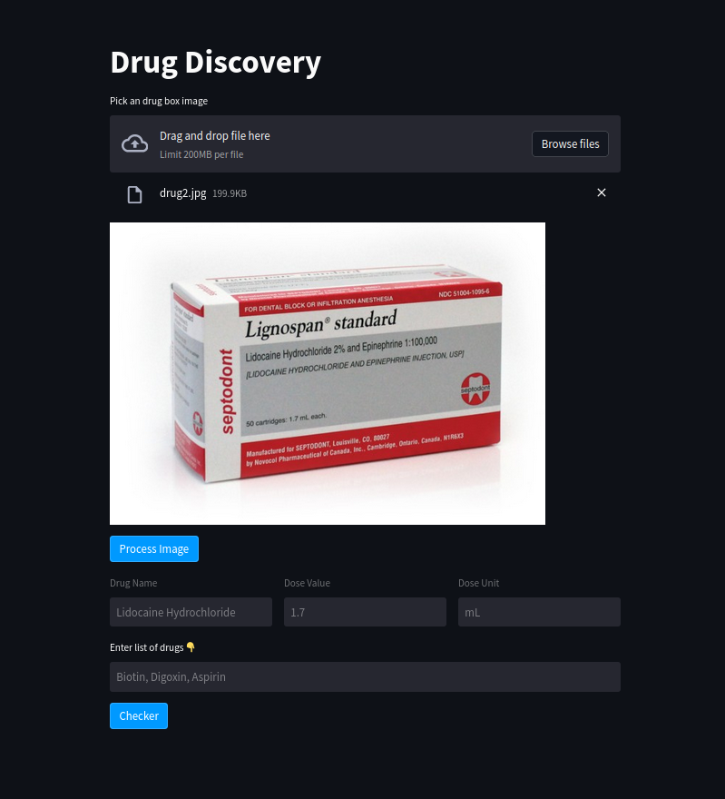

# Drug Discovery
This repo is integrated PaddleOCR with ChatGPT using Streamlit. We can upload image and extract the name of drug and dose, also we can put the list of string drug names and check drug interactions.In this app we run PaddleOCR on CPU, you can change the argument of that to GPU.



## Requirements

```
python -m pip install paddlepaddle-gpu -i https://mirror.baidu.com/pypi/simple

pip3 install -r requirements.txt

```

## How To Run
Set your openai api key in line 20 in app.py :  **os.environ["OPENAI_API_KEY"] = "Your_API-KEY"**

```
streamlit run app.py
```

Then enter the below url in your browser.


```
http://Yout_IP_Address:8501/
```